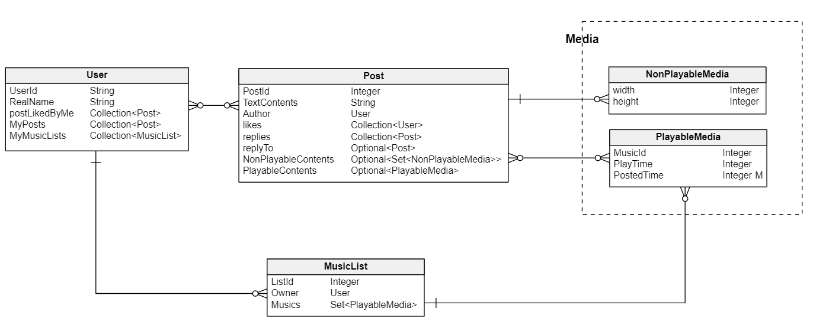

# BIE-TJV-Semester-Project \<Social Network System with Media\>
# Tools
- JDK 17
- Spring Boot 3.2.0
- H2 DB 2.2.224
- JPQL
- Gradle 8.5

## Optional Goal
Based on posts which each user liked, introducing recommendation system.

# Data

## User
### Field (Name: Description / Data Type / Nullable)
 - UserId: Identifier for farmers / Long / Not Null
 - RealName: Real name of farmer / String / Null
 - PostLikedByMe: Post I liked / Collection\<Post> / Null
 - MyPosts: Post I uploaded / Collection\<Post> / Null
 - MyMusicList: Music list I made by adding from Music Database / Collection\<Post> / Null

### Relation
with `Post`: 
- Many-to-Many Relation: "Like" system
- One-to-Many Relation: Creating by User

with `MusicList`:
 - One-to-Many Relation: Creating by User

## Post
### Field (Name: Description / Data Type / Nullable)
- PostId: Identifier for Post / Long / Not Null
- TextContents: Text Contents / String / Not Null
- Author: Author of the post / User / Not Null
- Likes: user who like this post / Collection\<User> / Null
- Optional Field (Post may contain some of these fields)
  - Non-playableMedia: Media contained in this post. can contain multiple media (i.e. Photos) / Collection\<NonplayableMedia> / Null
  - PlayableMedia: Media contained in this post. cna only contain single media (i.e. Music) / PlayableMedia / Null
  - Replies: Replies of this post / Collection\<Post> / Null
  - ReplyTo: target of reply of this post / Optional\<Post> / Null

### Relation
with `Uesr`: see User Section

with `Media`:
 - One-to-Many Relation: Single media file can be indicated by multiple Posts

## Media
### Field (Name: Description / Data Type / Nullable)
1. NonplayableMedia
- width: - / Long / Not Null
- height: - / Long / Not Null
2. PlayableMedia
- MusicId: identifier of music / Long / Not Null
- PlayTime: playtime of each music / Long / Not Null
- PostedTimes: how many posted / Long / Not Null (Default: 0)

### Relation
with `Post`: see Post Section

with `MusicList`:
 - Many-to-One Relation: single music list can contain multiple musics at a time.

## MusicList
### Field (Name: Description / Data Type / Nullable)
 - ListId: identifier of the lists / Long / Not Null
 - Owner: owner of this list / User / Not Null
 - Musics: Musics contained by this list / Collection\<PlayableMedia> / Null

### Relation

with `User`: See User Section

with `Media`: See Media Section

---

# Query
- Basic CRUD queries for each entity
- Find the musics which someone likes: return musics which searched user likes  

# Complex Business Operation Logic
Assumption: Behavior of Presentation Layer(user) is omitted. (Since I assumed all behaviors in this layer are just pressing the button as an action, update the window as a respondance)
## Uploading Post
When user upload the post,

first, server should create post in post repository.

Second, server should update the posted times of the music contained in the post.

Last, return the response of the post.
