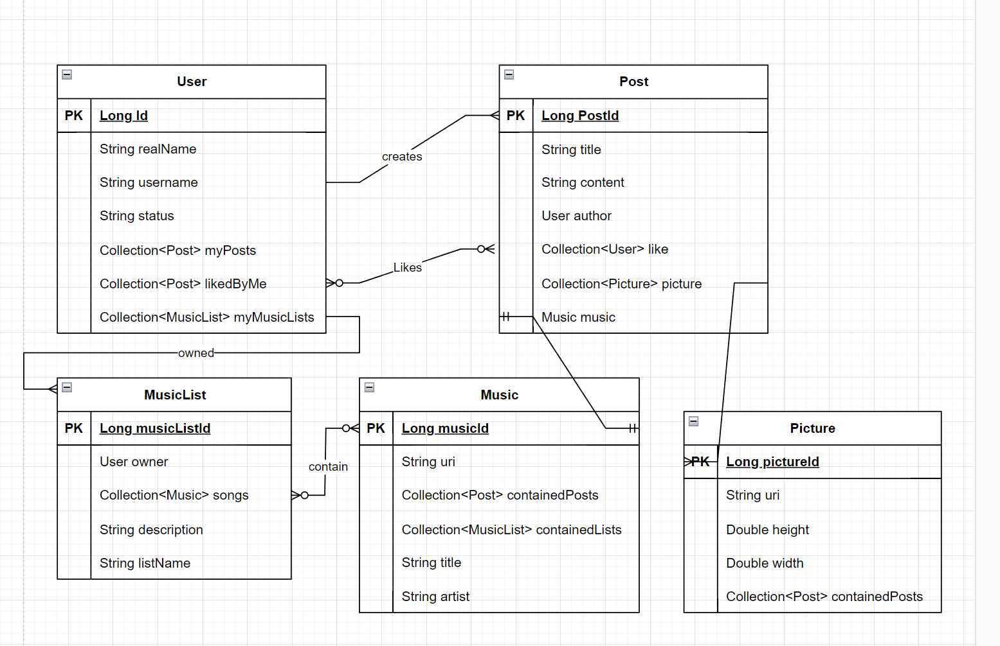
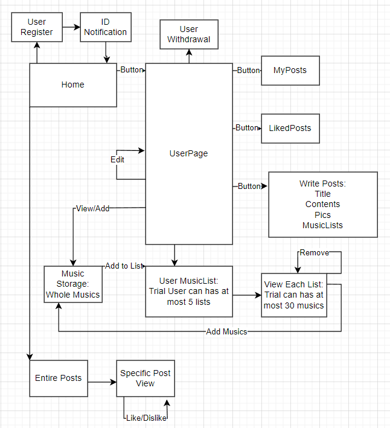

# BIE-TJV-Semester-Project \<Social Network System with Media\>
# Server
## Dependency
- JDK 17
- Spring Boot 3.2.0 (org.springframework.boot:spring-boot-starter-web)
- MySQL (mysql:mysql-connector-java:8.0.26)
- Spring Data JPA 2.6.0 (org.springframework.boot:spring-boot-starter-data-jpa)
- Gradle 8.5
- org.projectlombok:lombok
- org.springframework.boot:spring-boot-starter-test

# Data

## User
### Field (Name: Description / Data Type / Nullable)
 - UserId: Identifier for user / Long / Not Null
 - RealName: Real name of user / String / Null
 - String status: status of user / String / Not Null
 - String Introduction: Introduction of user / String / Null
 - PostLikedByMe: Post I liked / Collection\<Post> / Null
 - MyPosts: Post I uploaded / Collection\<Post> / Null
 - MyMusicList: Music list I made by adding from Music Database / Collection\<Post> / Null

### Relation
with `Post`: 
- Many-to-Many Relation: "Like" system
- One-to-Many Relation: Creating by User

with `MusicList`:
 - One-to-Many Relation: Creating by User

## Post
### Field (Name: Description / Data Type / Nullable)
- PostId: Identifier for Post / Long / Not Null
- Title: title of the post / String / Not Null
- Contents: Text Contents / String / Not Null
- Author: Author of the post / User / Not Null
- Likes: user who like this post / Collection\<User> / Null
- Optional Field (Post may contain some of these fields)
  - Picture: Media contained in this post. can contain multiple media / Collection\<Picture> / Null
  - Music: Media contained in this post. can contain multiple musics / List\<Music> / Null

### Relation
with `User`: see User Section

with `Picture`:
 - One-to-Many Relation: Single post can contain multiple pictures

with `Music`:
 - Many-to-One Relation: Single media file can be indicated by multiple Posts

## Media
### Field (Name: Description / Data Type / Nullable)
1. Picture
- id: identifier of picture / Long / Not Null
- uri: uri of picture / String / Not Null
- width: - / Long / Not Null
- height: - / Long / Not Null
2. Music
- id: identifier of music / Long / Not Null
- uri: uri of music(YouTube) / String / Not Null
- title: title of music / String / Not Null
- artist: artist of music / String / Not Null

### Relation
with `Post`: see Post Section

with `MusicList`:
 - Many-to-One Relation: single music list can contain multiple musics at a time.

## MusicList
### Field (Name: Description / Data Type / Nullable)
 - ListId: identifier of the lists / Long / Not Null
 - Owner: owner of this list / User / Not Null
 - listName: name of the list / String / Not Null
 - description: description of the list / String / Null

### Relation

with `User`: See User Section

with `Music`: See Media Section

---

# Query
- Basic CRUD queries for each entity
- Some Select queries with foreign key (e.g. select all posts with username)
- Return number of music list owned by specific user. (For restriction) 

# Complex Business Operation Logic
Assumption: Behavior of Presentation Layer(user) is omitted. (Since I assumed all behaviors in this layer are just pressing the button as an action, update the window as a respondance)

## Creating Music List, Adding Music to list.
1. Create Music List (Up to 3 lists for trial members)
   1. Check Available Music List Count
   2. If it is available, create music list
   3. If not, reject the request
2. Add Music to List (Up to 30 musics for trial members)
   1. Check Available Music Count
   2. If it is available, add music to list
   3. If not, reject the request

